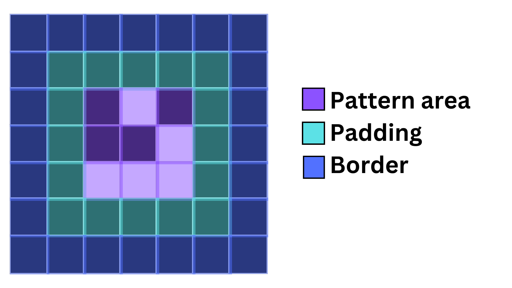
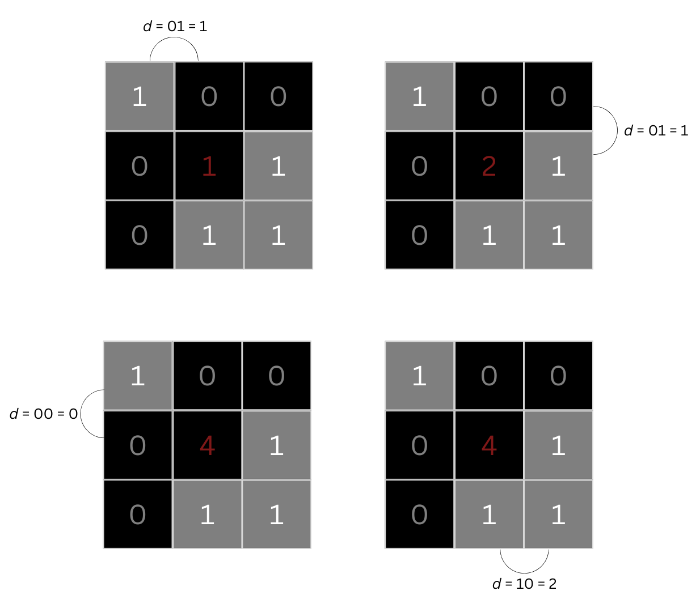
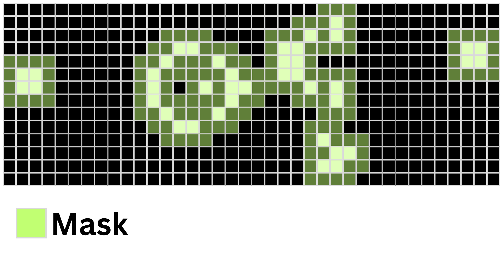

# Conway's Game of Life

evolution of my projects on Conway's Game of Life

## v1.0

### Implementation

#### Cells

Each cell is a class object storing its current state, the next state, its position as well as its neighbors' position

```python
class Cell:
    def __init__(self, y, x):
        self.currState = 0
        self.nextState = 0
        self.y = y - pivot[0]
        self.x = x - pivot[1]

        self.adjacent = [[self.y + 1, self.x], [self.y - 1, self.x], 
                        [self.y, self.x + 1], [self.y, self.x - 1], 
                        [self.y + 1, self.x + 1], [self.y + 1, self.x - 1], 
                        [self.y - 1, self.x + 1], [self.y - 1, self.x - 1]]
```

It also stores a method `nextgen(self)` which calculates the next state of the cell based on the rules of Conway's Game of Life.

#### World

The world is presented as a two-dimensional array with its elements as the cell objects. It has a padding to ensure that each live cell has a neighbour and a border to handle edge/corner cells. When the world is iterated through, the border is skipped.  



At each generation, the world is iterated through and each cell's next state is individually calculated. Once this is done, we iterate again, this time updating its current state value. Thus, completing a generation requires the time complexity of $O(m\times n)$, where $m$ and $n$ are respectively the world's height and width  

If any live cells are found in the paddings of the world, we extend the world by 1 row or column and each time we update the value of the pivot which allow the cells know that their position has been shifted.

#### Patterns and rendering

Each pattern is painstakingly mapped out cell by cell and its evolution is rendered using Unicode characters: ⬜ is alive and ⬛ is dead.  

To change the pattern displayed in the program, in `life.py` replace `line 103` with the corresponding code for each pattern (see below)

* Glider `patterns.Glider(world)`

* Gosper gun `patterns.GosperGun(world)`

* Pulsar `patterns.Pulsar(world)`

* Light-weight space ship `patterns.LWSS(world)`

* Random `patterns.Random(world)`

## v1.1

### Updates

Program can now import patterns directly from any source (there are many patterns available in the database of [Conway Life Wiki](https://conwaylife.com/wiki/))  

To use your own pattern:

1. Create an .rle file based on the format [here](https://conwaylife.com/wiki/Run_Length_Encoded)
2. Download this Git, extract the file all.zip, then put your pattern file in it
3. When running `life.py`, select 'd', then type your file name with the .rle
  
To generate a random pattern

1. Download this Git
2. Run `life.py` then select 'r'
  
To use a pattern from Conway Life Wiki

1. Download this Git
2. Extract the file all.zip, then place it in the same folder destination as the version you want to run.
3. Run `life.py` then select 'd'
4. Enter the file you want with the file extension '.rle'. For example: glider.rle

### Note

Some RLE pattern files on the Conway Life Wiki are incorrect as pointed out [here](https://conwaylife.com/forums/viewtopic.php?f=3&t=5533). Therefore, the decoder may not always work as intended.

## v2.0

### Implementation

#### Cells

Each cell is a binary integer: $0$ (dead) or $1$ (alive).

* When a cell is made alive, we change its binary value to $1$ then append the cell coordinate into the ___livingCell___ list.  
* Consequently, when a cell is dead, we would change its binary value to $0$ then remove its coordinate from the ___livingCell___ list.  

To count the number of neighbor alive, first, we initialise a variable to keep track of the number of living neighbors called ___alive___. Starting from the top-left neighbor, take its current state and the adjacent neighbor clockwise order, call them $b_1$ and $b_2$ respectively. Then, compute the following:  
> $c_1 = b_1 \land b_2$  
> $c_2 = b_1 \oplus b_2$  
> $d = (c_1 \ll 1) \lor c_2$  

Add to ___alive___ the integer equivalent of $d$, then move on to the next neighbor clockwise. After a full rotation, ___alive___ should now equal to the total number of neighbor a cell has. The image below will illustrates this process.



An advantage of this method is that we only need to iterate 4 times, corresponding to the 4 corners to count all the neighbors instead of having to iterate through every neighbors (9 times) like we did in version [1.0](https://github.com/Ya-Foo/Conways-game-of-life#v10).

After all that neighbor counting, the next state of the cell can be determined with the following expression

```python
int((alive == 3) or (world[y][x] and alive == 2))
```

These were not my idea, and the original can be found [here](https://www.zama.ai/post/concrete-boolean-and-conways-game-of-life-tutorial#:~:text=can%20be%20evaluated%20using%20boolean%20circuits).

#### World

Like in version 1.0, the world is represented as a 2D array with padding and border. However, a key difference in this version is that instead of iterating through all the cells, we only go through alive cells and their neighbors (we will refer to this region as 'mask'). This allows us to skip over cells that are guarenteed not to change state and save our computation power on those that may change.



Regarding our program's ability to expand the world once the padding contains a live cell, this method would save a lot of computing power as the number of live cell would not be increasing as fast as the expansion and some might even stay relatively the same. The time complexity will, however, degrade back to $O(m\times n)$ in soup (random) patterns because the live cells and its neighbors would likely take up the whole board.

#### Patterns and Rendering

The method of rendering is the same as our version [1.0](https://github.com/Ya-Foo/Conways-game-of-life#v10), however, thanks to the RLE decoder added in version [1.1](https://github.com/Ya-Foo/Conways-game-of-life#v11) we can place any pattern in the program.

## v2.1

### Implementation

#### Cells

Same as [2.0](https://github.com/Ya-Foo/Conways-game-of-life#v20)

#### World

The world is now a collection of alive cells which would reduce memory usage of the
program. Before in [2.0](https://github.com/Ya-Foo/Conways-game-of-life#v20), we use
the cell's state in the `world` to compute and append living cells to the `livingCells`
list but now we would have two separate list: `liminalCells` and `livingCells` to handle those task.  

Moreover, since an array is no longer used to store the position of the cells, the need of a pivot is also gone because every position is relative now.

#### Patterns and Rendering

Now that the `world` list is gone, our rendering method would changed significantly as
it cannot iterate through cell by cell anymore. Instead, what we have is a function that takes the coordinates of living cells then fill those coordinates with ⬜, otherwise it will fill with ⬛.

```python
for y in y_range:
    print(''.join('⬜' if [y,x] in livingCells else '⬛' for x in x_range))
```

Yet, this comes with a problem that the border may shrink at some point due to the decrease in area occupied by live cells, thus to prevent that from happening we keep track of the lowest and highest x and y coordinates the map has occupied before and only update the map when these values are exceeded.

## Stats/progress tracker

### Performance comparison

In this evaluation, we made each version compute 10,000 generations of a specific pattern. Each pattern will have 20 trials and then the mean of those (corrected to 3d.p) would be recorded in the table below. Only versions where the implementations are different will be tested. 
(not finished)
| Pattern           | v1.1      | v2.0      | v2.1      |
|-------------------|----------:|----------:|----------:|
| Glider            |     |     |     |
| Gosper Glider Gun |     |     |     |
| Brain             |     |     |     |
| LWSS              |     |     |     |
| R-pentomino       |     |     |     |
| Soup (random)     |     |     |     |
